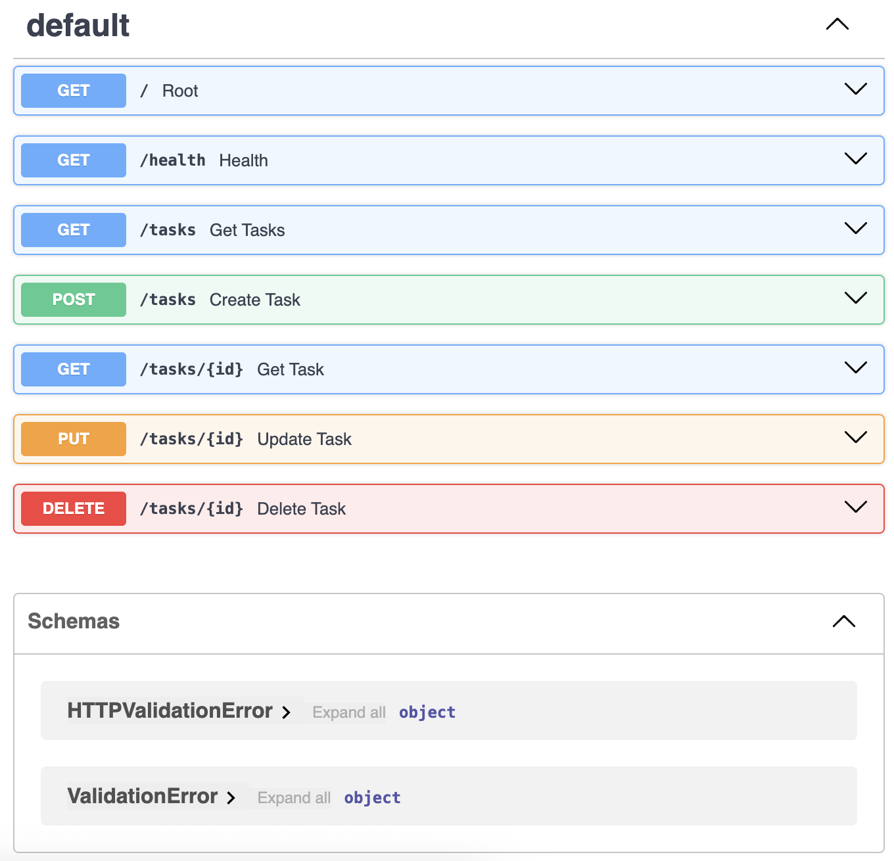
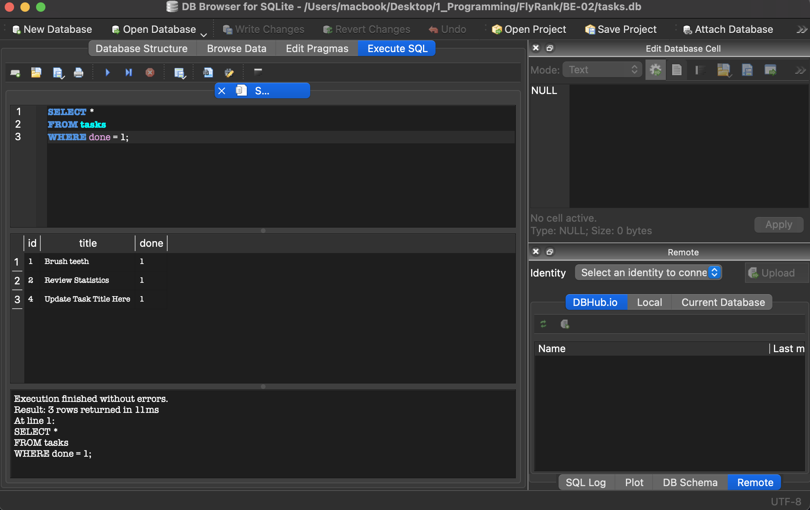

# Task API: A Basic To-Do List Manager CRUD API

---

## Overview

---

This project was created by **Joemarc Jr. D. Castillo** for compliance with the **FlyRank Internship's Week 3** Requirement ***Connecting to the database*** also known as _Assignment A2_ or _BE-02_ under the Backend AI Engineering Track. The update of this README markdown file specifically is a requirement to accomplish __Stage 5__ _(database documentation)_ of this assignment. In summary, **all six required stages were successfully implemented for this project.** In summary, this project is an upgrade of the first assignment. From a simple CRUD To-Do List API, this project became a step closer to becoming a production-level product as it now has its very own **database**. Because of this upgrade, data for the to-do list no longer live in memory; but in an actual permanent .db file (unless deleted of course).

## Dependencies, Installation, and Execution
*Note: Running these commands in a virtual environment(.venv) would be useful, especially if you don't plan to use the dependencies in this project elsewhere.*

**SQLite** is a simple and lightweight relational database engine. Since this is a simple project, SQLite is perfect for creating a prototype and exploring the basics of backend-to-database connection. Just from this simple upgrade, the data now lives in a single file and users can now access their past data without manually retyping their progress.

##### Project Dependencies:
Python 3.12+
FastAPI Library
SQLite3 (built-in in Python)

##### Installation
In your terminal, install the FastAPI library using the Python Package Installer (pip) 
`pip install "fastapi[standard]"`

##### Execution
Enter the path: ../BE-01
Run the following commands in your terminal:
[Mandatory]
`fastapi dev main.py`         - init server     

---

## Endpoints
| HTTP Method | Route | Description | Success Status | Client Error Status |
| :--- | :--- | :--- | :--- | :--- |
| `GET` | `/` | Returns base routing metadata. | `200 OK` | None |
| `GET` | `/health` | Returns server health status. | `200 OK` | None |
| `GET` | `/tasks` | Retrieves the complete collection of task objects. | `200 OK` | None |
| `GET` | `/tasks/{id}` | Retrieves a single task object mapped to the integer ID. | `200 OK` | `404 Not Found` |
| `POST` | `/tasks` | Instantiates a new task. Requires a JSON payload containing a valid `"title"` string. | `201 Created` | `400 Bad Request` |
| `PUT` | `/tasks/{id}` | Mutates an existing task state. Replaces existing keys with the provided JSON payload. | `200 OK` | `400 Bad Request`, `404 Not Found` |
| `DELETE` | `/tasks/{id}` | Destroys the task record mapped to the integer ID. Returns an empty envelope. | `204 No Content` | `404 Not Found` |

---

## Example Execution
The following demonstrates a standard HTTP `GET` request to enter the root page, executed via `curl`, alongside the strict response headers and serialized JSON payload returned by the server.

**Sample Command:**
Find Root
```bash
curl -X 'GET' \
  'http://127.0.0.1:8000/' \
  -H 'accept: application/json'
```

**Output:**
```text
content-length: 58 
content-type: application/json 
date: Sun,26 Jul 2026 09:33:48 GMT 
server: uvicorn 

{"name":"Task API","version":"1.0","endpoints":["/tasks"]
```

**Other useful commands:**
Get All Existing Tasks
```bash
curl -X 'GET' \
  'http://127.0.0.1:8000/tasks' \
  -H 'accept: application/json'
```

Create Your First Task
```bash
curl -X 'POST' \
  'http://127.0.0.1:8000/tasks' \
  -H 'accept: application/json' \
  -H 'Content-Type: application/json' \
  -d '{
  "title":"Input Task Here"
}'
```

Get a Specific Task
```bash
curl -X 'GET' \
  'http://127.0.0.1:8000/tasks/4' \
  -H 'accept: application/json'
}'
```

Update a Task
```bash
curl -X 'PUT' \
  'http://127.0.0.1:8000/tasks/4' \
  -H 'accept: application/json' \
  -H 'Content-Type: application/json' \
  -d '{
  "title": "Update Task Title Here",
  "done": true
}'
```

Delete a Task _(Note: This is JSON Syntax (Py: True != JS: true))_
```bash
curl -X 'PUT' \
  'http://127.0.0.1:8000/tasks/4' \
  -H 'accept: application/json' \
  -H 'Content-Type: application/json' \
  -d '{
  "title": "Update Task Title Here",
  "done": true
}'
```


## SwaggerUI Screenshot:


## Database open in DB Browser for SQLite Screenshot


## SQL Query from Stage 4
