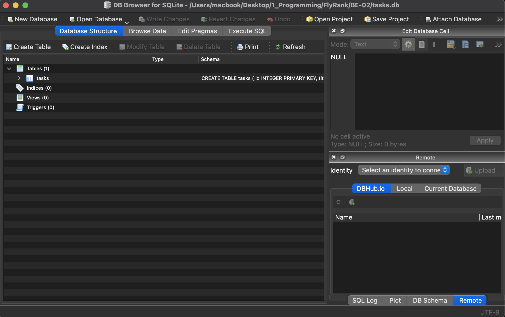
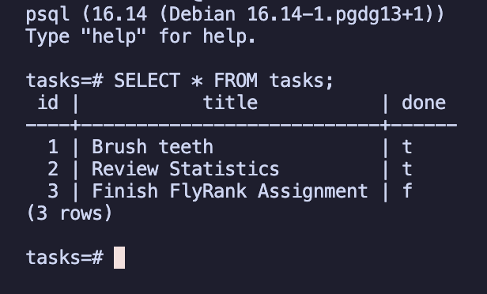

# Task API: Containerized To-Do List Manager (FastAPI + PostgreSQL)

---

## Overview

---

This project was created by **Joemarc Jr. D. Castillo** for compliance with the **FlyRank Internship's Week 3** Requirement, specifically under the **BE-04** module of the Backend AI Engineering Track. 

This API is a robust, "stateless" CRUD To-Do List manager. Upgrading from local memory and standard SQLite files, this iteration introduces a full production-ready architecture. The application (compute) is completely isolated from the PostgreSQL database (storage) using Docker containers. This ensures zero OS clutter and eliminates "works on my machine" bugs. 

Additionally, this version implements the **Repository Pattern** (`repository.py`) to cleanly abstract all database transaction logic away from the API routing layer, adhering to industry-standard design patterns for modularity and scalable system architecture.

## Execution (One-Command Stack)

This repository is designed so that anyone can clone it and run the entire API and database in under 5 minutes, with no manual database setup required.

**1. Environment Variables**
To securely connect the application to the database, you must configure your local environment variables. 
Copy the provided `.env.example` file and rename it to `.env`:

`cp .env.example .env`

Inside the `.env` file, you must define the following variable to construct the `DATABASE_URL`:
*   `POSTGRES_PASSWORD`: Assign a secure string password for the database superuser.

*(Note: Double-check that your `.env` file is git-ignored to prevent leaking database credentials.)*

**2. Start the Stack**
Run the following command in the root directory to build the images, spin up the network, and automatically seed the Postgres database:

`docker compose up`

*(To destroy the environment and wipe the database volume cleanly, run `docker compose down -v`.)*

---

## Endpoints
| HTTP Method | Route | Description | Success Status | Client Error Status |
| :--- | :--- | :--- | :--- | :--- |
| `GET` | `/` | Returns base routing metadata. | `200 OK` | None |
| `GET` | `/health` | Returns server health status. | `200 OK` | None |
| `GET` | `/tasks` | Retrieves the complete collection of task objects. | `200 OK` | None |
| `GET` | `/tasks/{id}` | Retrieves a single task object mapped to the integer ID. | `200 OK` | `404 Not Found` |
| `POST` | `/tasks` | Instantiates a new task. Requires a JSON payload containing a valid `"title"` string. | `201 Created` | `400 Bad Request` |
| `PUT` | `/tasks/{id}` | Mutates an existing task state. Replaces existing keys with the provided JSON payload. | `200 OK` | `400 Bad Request`, `404 Not Found` |
| `DELETE` | `/tasks/{id}` | Destroys the task record mapped to the integer ID. Returns an empty envelope. | `204 No Content` | `404 Not Found` |

---

---

## Example Execution
The following demonstrates a standard HTTP `GET` request to retrieve all seeded tasks, executed via `curl -i` to show the full round-trip HTTP response headers alongside the serialized JSON payload.

**Command:**
```bash
curl -X 'GET' \
  'http://0.0.0.0:8000/' \
  -H 'accept: application/json'
```

**Output:**
```text
content-length: 58 
content-type: application/json 
date: Sun,26 Jul 2026 09:33:48 GMT 
server: uvicorn 

{"name":"Task API","version":"1.0","endpoints":["/tasks"]
```

**Other useful commands:**
Get All Existing Tasks
```bash
curl -X 'GET' \
  'http://127.0.0.1:8000/tasks' \
  -H 'accept: application/json'
```

Create Your First Task
```bash
curl -X 'POST' \
  'http://127.0.0.1:8000/tasks' \
  -H 'accept: application/json' \
  -H 'Content-Type: application/json' \
  -d '{
  "title":"Input Task Here"
}'
```

Get a Specific Task
```bash
curl -X 'GET' \
  'http://127.0.0.1:8000/tasks/4' \
  -H 'accept: application/json'
}'
```

Update a Task
```bash
curl -X 'PUT' \
  'http://127.0.0.1:8000/tasks/4' \
  -H 'accept: application/json' \
  -H 'Content-Type: application/json' \
  -d '{
  "title": "Update Task Title Here",
  "done": true
}'
```

Delete a Task _(Note: This is JSON Syntax (Py: True != JS: true))_
```bash
curl -X 'PUT' \
  'http://127.0.0.1:8000/tasks/4' \
  -H 'accept: application/json' \
  -H 'Content-Type: application/json' \
  -d '{
  "title": "Update Task Title Here",
  "done": true
}'
```


## SwaggerUI Screenshot:


## Database open in DB Browser for SQLite Screenshot


## SQL Query from Stage 4


## PSQL Query Screenshot
